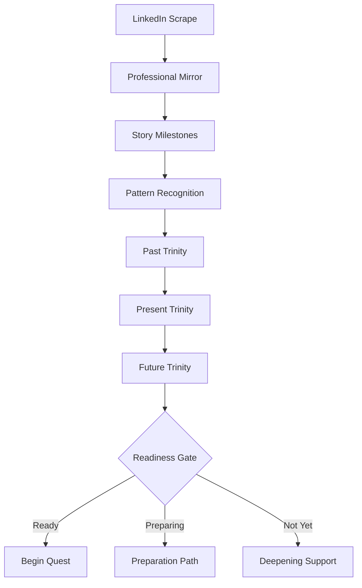

# Quest Core V2 - Story → Trinity → Quest Architecture

> "You can't begin your Quest until we understand your story"

## 🎯 Core Philosophy

Quest Core V2 revolutionizes professional development by requiring users to **earn their Quest through story**. This isn't registration - it's initiation.

### The Journey
1. **Story**: Reflect on your professional journey
2. **Trinity Evolution**: Discover how your purpose has evolved (Past → Present → Future)
3. **Quest Readiness**: Earn the right to begin your Quest

### Key Innovation: Trinity Evolution Through Time

Users discover not one Trinity, but three:
- **Past Trinity**: What drove you, how you served, what you pledged (looking back)
- **Present Trinity**: What drives you now, how you serve now, what you pledge now  
- **Future Trinity**: What will drive you, how you'll serve, what you'll pledge (becomes your Quest)

## 🎭 The Three-Act Structure

### Act 1: Professional Mirror (3-5 minutes)
**"This is how the world sees you"**

```typescript
interface ProfessionalMirror {
  trigger: "LinkedIn URL or profile search";
  
  presentation: {
    frame: "Your professional mirror - how others see you";
    tone: "Curious, non-judgmental";
    visual: "Timeline beginning to form";
  };
  
  coaching: {
    style: "The Biographer";
    approach: "Tell me about this transition...";
    goal: "Surface story, not interrogate";
  };
  
  output: {
    milestones: CareerMilestone[];
    corrections: UserCorrection[];
    engagement: StoryDepthScore;
  };
}
```

**Key Questions**:
- "What drew you to [University/Field]?"
- "Tell me about this career transition..."
- "What was happening in your life then?"

### Act 2: Trinity Recognition (5-7 minutes)
**"Your purpose has evolved through your journey"**

```typescript
interface TrinityEvolution {
  past: {
    quest: "What drove you in early career?";
    service: "How did you contribute then?";
    pledge: "What did you promise yourself?";
    visual: "Constellation forming from past";
  };
  
  present: {
    quest: "What drives you today?";
    service: "How do you serve now?";
    pledge: "What do you pledge currently?";
    visual: "Constellation brightening";
  };
  
  future: {
    quest: "What will drive you forward?";
    service: "How will you serve tomorrow?";
    pledge: "What will you pledge to become?";
    visual: "Constellation crystallizing";
  };
  
  recognition: {
    pattern: "Notice how your Trinity has evolved...";
    validation: "Does this journey resonate?";
    emergence: "Your Quest emerges from this evolution";
  };
}
```

**Visual Design**: Trinity constellation that evolves through time, showing growth and transformation.

### Act 3: Quest Readiness Gate
**"Are you ready for your Quest?"**

```typescript
interface QuestReadiness {
  assessment: {
    storyDepth: number;      // 0-100
    trinityClarity: number;  // 0-100
    futureOrientation: number; // 0-100
    overallReadiness: ReadinessLevel;
  };
  
  levels: {
    ready: {
      threshold: 70;
      message: "Your journey reveals you're ready for your Quest";
      action: "Begin Quest";
      ceremony: "Trinity crystallization animation";
    };
    
    preparing: {
      threshold: 50;
      message: "Your Quest is forming. Let's clarify together.";
      action: "Guided preparation exercises";
      support: "Weekly check-ins with Pattern Seeker";
    };
    
    notYet: {
      threshold: 0;
      message: "Great Quests require clear vision. Yours is still emerging.";
      action: "Story deepening journey";
      support: "Community of fellow seekers";
    };
  };
}
```

## 🧭 Implementation Architecture

### Data Flow


### Coach Personalities

#### The Biographer (Act 1)
- **Voice**: Warm, curious, patient
- **Focus**: Understanding without judgment
- **Questions**: Open-ended, story-eliciting
- **Never**: Rushes or judges

#### The Pattern Seeker (Act 2)
- **Voice**: Insightful, connecting, revealing
- **Focus**: Illuminating connections
- **Questions**: Reflective, pattern-surfacing
- **Never**: Forces connections

#### The Quest Guides (Act 3)
- **Voice**: Inspiring, future-focused, empowering
- **Focus**: Activating potential
- **Questions**: Action-oriented, possibility-expanding
- **Never**: Generic or prescriptive

### Technical Implementation

#### Story Collection
```typescript
interface StoryCollector {
  // Progressive disclosure
  milestones: {
    education: EducationMilestone[];
    career: CareerMilestone[];
    transitions: TransitionPoint[];
    achievements: Achievement[];
  };
  
  // User corrections become part of story
  corrections: {
    original: ScrapedData;
    corrected: UserData;
    insight: "This correction reveals...";
  };
  
  // Depth tracking
  engagement: {
    timeSpent: number;
    correctionsMode: number;
    reflectionDepth: 1-5;
    emotionalResonance: boolean;
  };
}
```

#### Trinity Pattern Recognition
```typescript
interface TrinityPatterns {
  // Analyze story for Trinity themes
  extractPatterns(story: UserStory): {
    driveThemes: Theme[];      // → Quest patterns
    contributionThemes: Theme[]; // → Service patterns
    commitmentThemes: Theme[];   // → Pledge patterns
  };
  
  // Map themes to Trinity evolution
  mapEvolution(themes: Themes): {
    past: Trinity;    // Historical patterns
    present: Trinity; // Current state
    future: Trinity;  // Projected growth
  };
  
  // Generate personalized articulation
  articulate(evolution: TrinityEvolution): {
    questStatement: string;
    serviceStatement: string;
    pledgeStatement: string;
  };
}
```

## 🎨 Experience Design

### Visual Journey
```
Opening Screen:
"Begin your professional reflection"
(No mention of registration)
↓
Mirror Reveal:
Timeline appears with scraped data
"This is how the world sees you"
↓
Story Building:
Milestones expand as user shares
Coach questions appear contextually
↓
Trinity Emergence:
Constellation builds through story
Past → Present → Future revealed
↓
Readiness Gate:
Assessment visualization
Clear next steps
```

### Language Evolution
Never use:
- "Register" / "Sign up"
- "Create account"
- "Join Quest"

Always use:
- "Begin your story"
- "Discover your Quest"
- "Earn your journey"

## 📊 Success Metrics

### Engagement Metrics
- Story completion rate: >80%
- Average story depth: 7-10 milestones explored
- Trinity resonance score: >4.5/5
- Time in experience: 10-15 minutes

### Readiness Distribution
- Ready (first attempt): 70%
- Preparing: 25%
- Not Yet: 5%

### Quality Indicators
- Not Yet users who return: >60%
- Preparing → Ready conversion: >80%
- Word-of-mouth about "earning" Quest: Track social mentions

## 🚫 The "Not Yet" Experience

### Philosophy
Being told "not yet" should feel like:
- A challenge, not rejection
- An invitation to grow
- A badge of honor when eventually earned

### Implementation
```typescript
interface NotYetPath {
  messaging: {
    primary: "Your Quest is still forming";
    supportive: "Great journeys require clear vision";
    encouraging: "We'll support you until ready";
  };
  
  support: {
    weeklyPrompts: ReflectionPrompt[];
    peerStories: AnonymizedJourneys[];
    miniChallenges: ClarityExercise[];
    checkIns: CoachTouchpoint[];
  };
  
  gamification: {
    clarityProgress: ProgressBar;
    insightBadges: Badge[];
    readinessIndicator: Gauge;
  };
}
```

## 🔐 Privacy & Trust

### Data Handling
- Story data is sacred - highest encryption
- User owns their narrative completely
- Corrections improve future scraping
- Sharing is optional and granular

### Trust Building
- Transparent about "mirror" imperfection
- Celebrate corrections as collaboration
- Never judge story content
- Always validate user experience

## 🚀 Why This Changes Everything

### For Users
- First platform that truly understands before helping
- Registration becomes meaningful self-discovery
- Creates investment before asking for commitment
- Makes professional development sacred, not casual

### For Quest Core
- Uncopiable differentiation (philosophy + tech)
- Higher quality user base (self-selected depth)
- Rich context for all future interactions
- Viral potential ("I had to earn my Quest")

### For the Industry
- Reframes professional development as earned privilege
- Sets new standard for user understanding
- Makes "quick registration" feel hollow
- Creates new category: Professional Awakening Platform

## 📋 Implementation Checklist

### Week 1: Foundation
- [ ] Professional Mirror MVP with LinkedIn scraping
- [ ] Basic story visualization (timeline)
- [ ] Biographer coach personality
- [ ] Story depth tracking

### Week 2: Trinity Evolution
- [ ] Pattern recognition system
- [ ] Past/Present/Future Trinity visualization
- [ ] Pattern Seeker coach personality
- [ ] Trinity resonance validation

### Week 3: Quest Readiness
- [ ] Readiness assessment algorithm
- [ ] Three-path system (Ready/Preparing/Not Yet)
- [ ] Quest Guide personalities
- [ ] Not Yet support system

### Week 4: Polish & Launch
- [ ] Complete visual journey
- [ ] Coach handoff refinement
- [ ] Analytics and metrics
- [ ] A/B testing framework

## 🎯 Final Vision

Quest Core V2 becomes the platform where:
- **Stories are honored**, not harvested
- **Purpose is discovered**, not assigned
- **Quests are earned**, not given
- **Growth is guided**, not prescribed

This isn't just better registration - it's a completely new paradigm for professional development platforms.

**"Your Quest begins when you're ready. Let's discover if you are."**